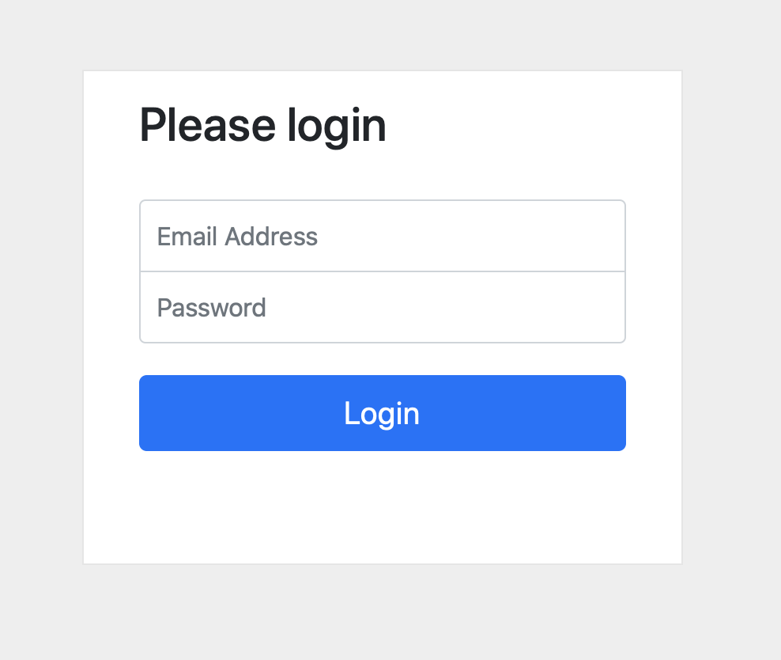
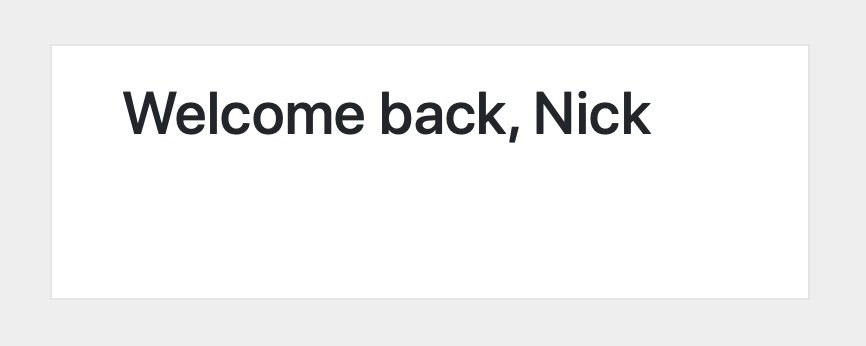
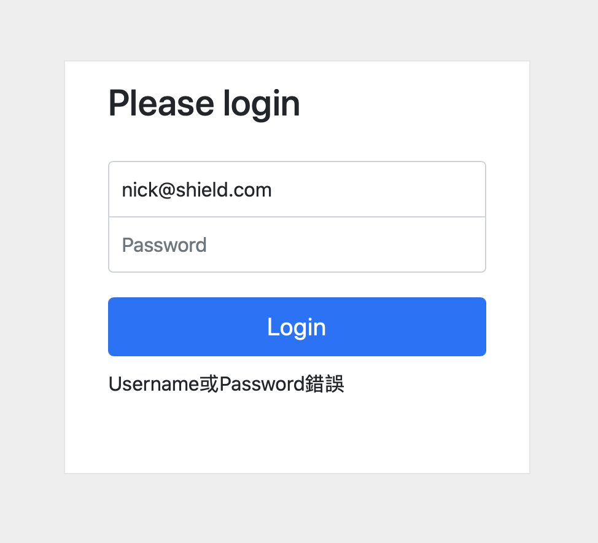

<h1>使用者認證登入頁面</h1>

運用Node.js搭配Express框架及express-handlebars搭建的簡易式「使用者認證登入頁面」。

<h3>功能描述 (features)：</h3>
    <h4>使用者可輸入帳密後按登入</h4>
       

    <h4>成功會跳轉登入成功頁面</h4>
       

    <h4>失敗則會停留在登入頁並顯示帳密輸入錯誤訊息</h4>
       

<h3>環境建置與需求 (prerequisites)：</h3>
  Node.js  
  Terminal
  
<h3>安裝與執行步驟 (installation and execution)：</h3>
  1. 打開終端機並複製此專案至本機
  <pre><code>git clone https://github.com/diosleonor/User-authentication-project</code></pre>
  
  2. 複製完成後進入專案資料夾
  <pre><code>cd User-authentication-project</code></pre>
  
  3. 安裝Node套件管理器(npm)
  <pre><code>npm install</code></pre>
  
  4. 用npm安裝種子資料
  <pre><code>npm run seed</code></pre>

  5. 用npm啟動伺服器
  <pre><code>npm run dev</code></pre>
  或是
  <pre><code>npm run start</code></pre>

  6. 開啟網頁瀏覽器並連結到此網址即可開始使用登入頁面囉
   <pre><code>http://localhost:3000</code></pre>
  
<h3>開發工具及版本 (dev tools information)：</h3>
  Node.js v14.18.1  
  Node Project Manager 8.1.0  
  Express v4.17.1  
  express-handlebars v5.3.4  
  body-parser v1.19.0 
  Bootstrap v4.3.1  
  jquery v3.3.1  
  popper v2.9.1  
  mongoose v6.0.12 

